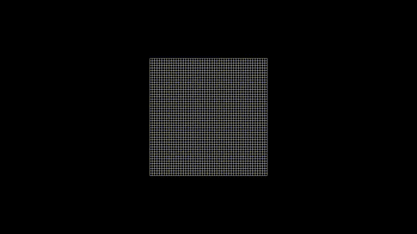

SpaceTimeFabric Class
=====================

The `SpaceTimeFabric` class is designed to visualize the effects of gravitational fields on a space-time fabric. This class can be used in various scenarios to illustrate gravitational interactions and distortions caused by massive objects.

Overview
--------

The `SpaceTimeFabric` class takes parameters to define the ranges and resolution of the fabric, allowing for dynamic visualizations of gravitational effects in a 3D environment.

Parameters
----------

- **u_range** (`tuple`): Specifies the range of the u-axis.
- **v_range** (`tuple`): Specifies the range of the v-axis.
- **resolution** (`tuple`): Defines the resolution of the grid used to create the fabric.
- **t_range** (`tuple`): Specifies the range of time values for the animation.
- **scaling_factor** (`float`): Scales the visual representation of the fabric.
- **func** (`function`): Function to compute the gravitational potential based on object positions.
- **func_args** (`tuple`): Additional arguments to be passed to the `func` function.

Examples
--------

Illustration of Space-Time Fabric Distortion by a Star
------------------------------------------------------
This example demonstrates how the presence of massive objects, like stars, distorts the space-time fabric.

.. code-block:: python

    from manim import *
    import numpy as np
    from manim_Astronomy.stellar_objects import *

    def gravitational_potential(u, v, mass_positions, masses):
        G = 1 
        potential = 0
        epsilon = 0.1  
        for i in range(len(mass_positions)):
            mass_posu, mass_posv, mass_posz = mass_positions[i]
            M = masses[i]
            r = np.sqrt((u - mass_posu)**2 + (v - mass_posv)**2 + mass_posz**2)
            if r < epsilon:
                r += 0.05
            potential += -G * M / r 
        return potential

    class SpaceTimeFabricDistortionByAStar(ThreeDScene):
        def construct(self): 
            mass1 = Dot3D(point=[0, 0, 0.3], radius=0.3)
            mass2 = Dot3D(point=[1.1, 0, 0], radius=0.05)
            fabric = SpaceTimeFabric(
                u_range=(-2, 2),
                v_range=(-2, 2),
                resolution=(50, 50),
                t_range=(-2, 2)
            )
            self.add(fabric)
            self.move_camera(phi=70 * DEGREES, theta=-90 * DEGREES)
            self.wait(3)

            def fabric_updater(mob):
                mob.become(SpaceTimeFabric(
                    u_range=(-2, 2),
                    v_range=(-2, 2),
                    resolution=(50, 50),
                    t_range=(-2, 2),
                    scaling_factor=0.01,
                    func=gravitational_potential,
                    func_args=([mass1.get_center(), mass2.get_center()], [50, 2])
                ))
            fabric.add_updater(fabric_updater)
            self.play(FadeIn(mass1, mass2))
            self.wait(3)
            self.wait(10)
            

Illustration of Black Hole Merger Distorting Space-Time Fabric
--------------------------------------------------------------

This example demonstrates the merging of two black holes, that spiral towards each other, affecting the surrounding space-time fabric.

.. code-block:: python

    from manim import *
    import numpy as np
    from manim_Astronomy.stellar_objects import * 

    def gravitational_potential(u, v, mass_positions, masses):
        G = 1 
        potential = 0
        epsilon = 0.1  
        for i in range(len(mass_positions)):
            mass_posu, mass_posv, mass_posz = mass_positions[i]
            M = masses[i]
            r = np.sqrt((u - mass_posu)**2 + (v - mass_posv)**2 + mass_posz**2)
            if r < epsilon:
                r += 0.05
            potential += -G * M / r 
        return potential

    class BlackHolesMerger(ThreeDScene):
        def construct(self):
            mass1 = Dot3D(point=[-1, 0, 0], radius=0.1, color=BLACK)
            mass2 = Dot3D(point=[1, 0, 0], radius=0.1, color=BLACK)
            masses = VGroup(mass1, mass2)
            merged_mass = Dot3D(point=[0, 0, 0], radius=0.15, color=BLACK)
            fabric = SpaceTimeFabric(
                u_range=(-2, 2),
                v_range=(-2, 2),
                resolution=(50, 50),
                t_range=(-2, 2),
                scaling_factor=0.01,
                func=gravitational_potential,
                func_args=([mass1.get_center(), mass2.get_center()], [50, 50])
            )
            self.add(fabric, mass1, mass2)
            self.move_camera(phi=70 * DEGREES, theta=-90 * DEGREES)
            
            def fabric_updater(mob):
                mob.become(SpaceTimeFabric(
                    u_range=(-2, 2),
                    v_range=(-2, 2),
                    resolution=(50, 50),
                    t_range=(-2, 2),
                    scaling_factor=0.01,
                    func=gravitational_potential,
                    func_args=([mass1.get_center(), mass2.get_center()], [50, 50])
                ))
            fabric.add_updater(fabric_updater)

            def update_mass1(mob, dt=1):
                x, y, _ = mob.get_center()
                r = np.sqrt(x**2 + y**2)
                theta = np.arctan2(y, x)
                dr = -0.1 * dt  
                dtheta = -2 * dt / r  
                r += dr
                theta += dtheta
                mob.move_to([r * np.cos(theta), r * np.sin(theta), 0])

            def update_mass2(mob, dt=1):
                x, y, _ = mob.get_center()
                r = np.sqrt(x**2 + y**2)
                theta = np.arctan2(y, x)
                dr = -0.1 * dt  
                dtheta = 2 * dt / r 
                r += dr
                theta += dtheta
                mob.move_to([r * np.cos(theta), r * np.sin(theta), 0])

            mass1.add_updater(update_mass1)
            mass2.add_updater(update_mass2)
            self.wait(10)
            self.play(ReplacementTransform(masses, merged_mass))
            self.wait(10)

Illustration of Gravitational Waves After Black Hole Merger
-----------------------------------------------------------

This example demonstrates how gravitational waves ripple through space-time after two black holes merge, simulating the wavefronts created by the massive collision.

.. code-block:: python

    import numpy as np
    from manim import *
    from manim_Astronomy.stellar_objects import *
    
    def wave_function(u, v, t):
        wavelength = 0.5
        amplitude = 0.2
        distance_from_center = np.sqrt(u**2 + v**2)
        return amplitude * np.sin(2 * np.pi * (distance_from_center - t) / wavelength)

    class GravitationalWaves(ThreeDScene):
        def construct(self):
            merged_masses = Dot3D(point=[0, 0, 0], radius=0.15, color=BLACK)
            fabric = SpaceTimeFabric(
                u_range=(-2, 2),
                v_range=(-2, 2),
                resolution=(50, 50),
                t_range=(-2, 2),
                scaling_factor=0.1,
            )
            self.set_camera_orientation(phi=70 * DEGREES, theta=-90 * DEGREES)
            self.add(fabric, merged_masses)
            self.wait(1)
            t_tracker = ValueTracker(0)

            def update_fabric(mob):
                t = t_tracker.get_value()
                mob.become(SpaceTimeFabric(
                    u_range=(-2, 2),
                    v_range=(-2, 2),
                    resolution=(50, 50),
                    scaling_factor=0.1,
                    t_range=(-2, 2),
                    func=wave_function,
                    func_args=(t,)
                ))

            fabric.add_updater(update_fabric)
            self.play(t_tracker.animate.increment_value(5), run_time=10, rate_func=linear)
            self.wait(2)

